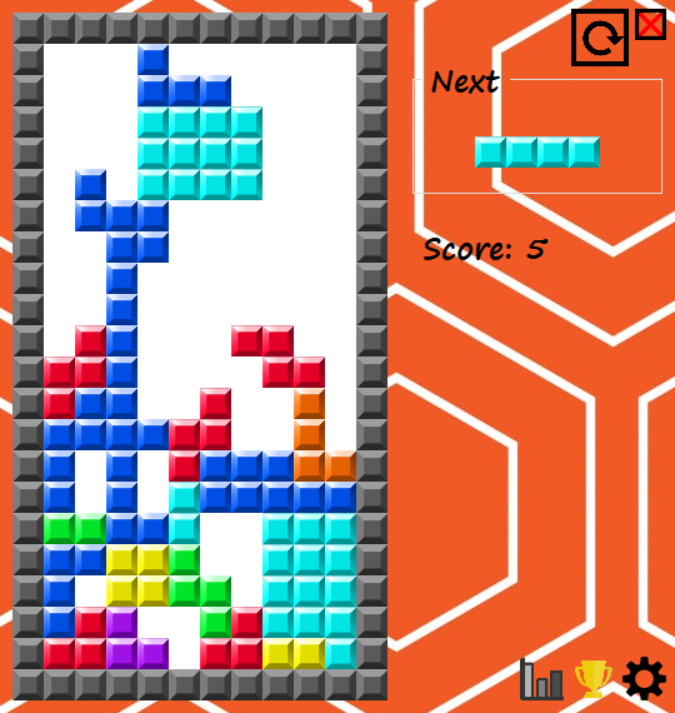
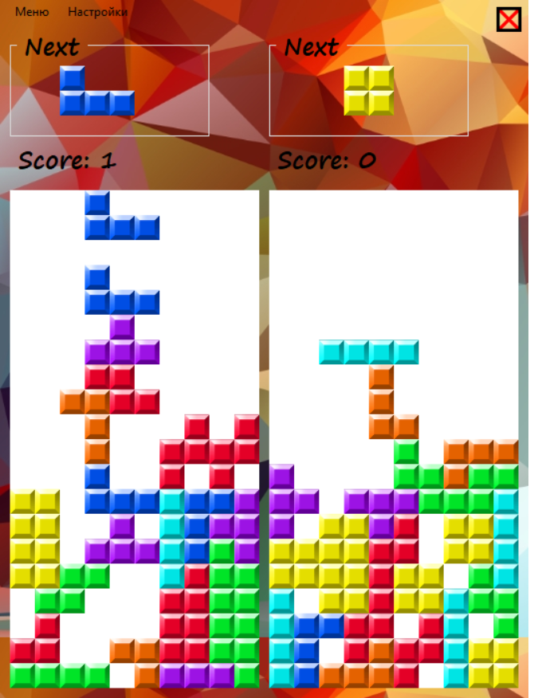

# Tetris
My first (written before "2048" and "RLY") "serious" project in C#. Warning: a lot of bad code. Windows Forms.

Этот тетрис писался при базовых знаниях языка. Много плохого кода, но ведь все с чего-то начинали?

©Linerath, 2017
